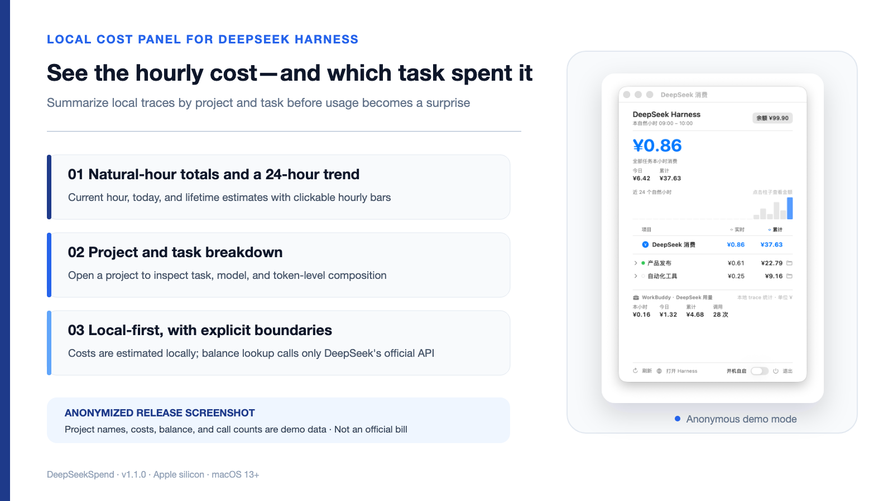

<p align="center">
  <a href="README.md">简体中文</a> &nbsp;·&nbsp; <b>English</b>
</p>

# DeepSeekSpend

<p align="center">
  
</p>

<p align="center">
  A local macOS menu-bar panel for estimated DeepSeek Harness cost by natural hour, project, and task.
</p>

<p align="center">
  <a href="LICENSE"></a>
  
  
  <a href="https://github.com/yinshi1226-ai/DeepSeekSpend/actions"></a>
  <a href="https://github.com/yinshi1226-ai/DeepSeekSpend/releases"></a>
</p>

> [!IMPORTANT]
> Values are calculated from local token records and the bundled price table. They are usage estimates, not an official DeepSeek bill. Use the official platform for balance, recharge, and final charges.

## What it shows

- Current natural-hour estimate in the menu bar: `● ¥X.XX`.
- Current hour, today, and lifetime totals in one panel.
- A clickable 24-hour usage chart.
- Per-project live and lifetime estimates, expandable to tasks, models, and token composition.
- Child-agent usage merged into its parent task; empty sessions are filtered out.
- A separate WorkBuddy DeepSeek summary with estimated cost and call count.
- Optional DeepSeek account balance with a direct link to the official platform.

## Interface

<p align="center">
  
</p>

The screenshot is generated with the built-in `--demo` mode. Project names, costs, balance, and call counts are demonstration data.

## Pricing formula

```text
estimate = uncached input tokens × input price
         + cached input tokens × cache-hit price
         + output tokens × output price
```

The bundled CNY table follows the official prices for `deepseek-v4-pro` and `deepseek-v4-flash` on the [DeepSeek pricing page](https://api-docs.deepseek.com/quick_start/pricing/). Unknown models are not silently priced as another model: they contribute 0 and produce a snapshot warning.

## Install

### Download a release

1. Open the [latest release](https://github.com/yinshi1226-ai/DeepSeekSpend/releases/latest) and download `DeepSeekSpend-v*-macOS-arm64.zip`.
2. Unzip and move `DeepSeekSpend.app` to Applications or another fixed location.
3. On first launch, right-click the app and choose **Open** to confirm the locally signed build.
4. Optionally enable launch at login in the footer.

The release bundles a compatible Node.js runtime. Users do not need to install Node separately. Current builds support Apple silicon and macOS 13 or later.

### Build from source

```bash
git clone https://github.com/yinshi1226-ai/DeepSeekSpend.git
cd DeepSeekSpend
npm test
./build.sh release
open ../DeepSeekSpend.app
```

Source builds require the Swift toolchain and Node.js 22.15 or later.

## Data and privacy

| Data | Local source or network boundary |
|---|---|
| Harness tasks and tokens | `~/Documents/DeepSeek-Harness/data/sessions/**/session.jsonl.zstd` and the local Harness API |
| Project running state | `http://127.0.0.1:3080/api/session.list` |
| WorkBuddy usage | `~/.workbuddy/traces/**/*.json` |
| Account balance (optional) | API key is used only for DeepSeek's official `https://api.deepseek.com/user/balance` endpoint |

- Task parsing and cost estimation happen locally.
- Project names and task details are not sent to third-party services.
- The app contains no telemetry or advertising SDK.
- Balance lookup sends the Harness-configured API key only to DeepSeek's official endpoint; local statistics still work without it.
- The app is ad-hoc signed and does not create or install a self-signed root certificate.

See [SECURITY.md](SECURITY.md) for boundaries and vulnerability reporting.

## Configuration

Runtime configuration is stored at `~/Library/Application Support/DeepSeekSpend/config.json`:

- `prices`: CNY per million tokens;
- `apiBase`: local DeepSeek Harness address;
- `pollIntervalMs` / `balanceIntervalMs`: collection intervals;
- `workbuddyTracesDir`: WorkBuddy trace directory.

Upgrades keep local paths and polling settings while refreshing the verified bundled price table.

## Development

```bash
npm test
./build.sh
./build.sh release
```

## License

[MIT](LICENSE)
