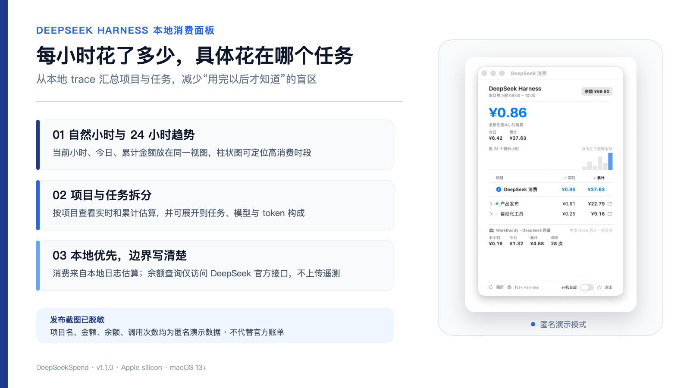
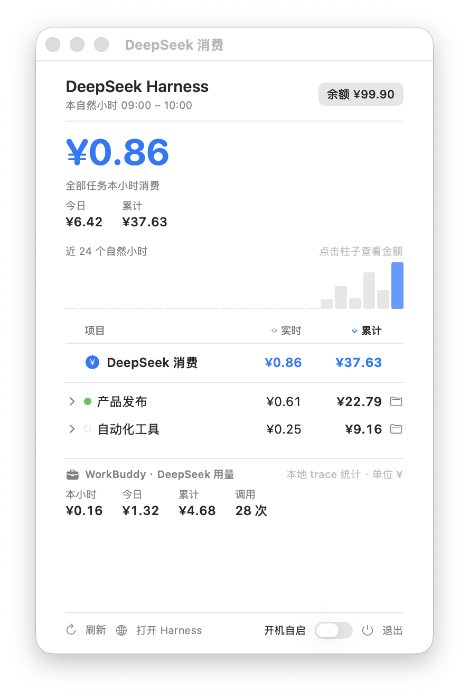

<p align="center">
  <b>简体中文</b> &nbsp;·&nbsp; <a href="README.en.md">English</a>
</p>

# DeepSeekSpend

<p align="center">
  
</p>

<p align="center">
  一个放在 macOS 菜单栏里的本地消费面板：查看 DeepSeek Harness 每个自然小时、项目和任务的用量估算。
</p>

<p align="center">
  <a href="LICENSE"></a>
  
  
  <a href="https://github.com/yinshi1226-ai/DeepSeekSpend/actions"></a>
  <a href="https://github.com/yinshi1226-ai/DeepSeekSpend/releases"></a>
</p>

> [!IMPORTANT]
> 面板金额由本地 token 记录和价格表计算，是便于观察趋势的估算值，不是 DeepSeek 官方账单。充值、余额和最终扣费请以官方平台为准。

## 你能看到什么

- 菜单栏常驻显示当前自然小时的消费估算：`● ¥X.XX`。
- 弹窗汇总本小时、今日和历史累计金额。
- 近 24 个自然小时柱状图，点击柱子可查看对应小时。
- 项目列表同时显示实时与累计金额，展开后可看到任务、模型及 token 构成。
- 顶层任务自动合并其子代理消费，空白会话不进入列表。
- 单独汇总 WorkBuddy 的 DeepSeek 用量和调用次数。
- 可选显示 DeepSeek 账户余额；点击后跳转官方平台。

## 界面

<p align="center">
  
</p>

截图由内置 `--demo` 模式生成。项目名、金额、余额和调用次数均为演示数据，不包含个人记录。

## 计价口径

```text
消费估算 = 未命中缓存的输入 token × 输入价
         + 命中缓存的输入 token × 缓存价
         + 输出 token × 输出价
```

默认价格表依据 [DeepSeek 官方定价页](https://api-docs.deepseek.com/zh-cn/quick_start/pricing/) 中的 `deepseek-v4-pro` 与 `deepseek-v4-flash` 人民币价格维护。未知模型不会被悄悄套用其他模型价格，而是计为 0 并在快照错误中提示。

## 安装

### 下载 Release（推荐）

1. 打开 [最新 Release](https://github.com/yinshi1226-ai/DeepSeekSpend/releases/latest)，下载 `DeepSeekSpend-v*-macOS-arm64.zip`。
2. 解压，把 `DeepSeekSpend.app` 拖到“应用程序”，也可以放在其他固定位置。
3. 首次启动时右键 App →“打开”，确认运行本地签名应用。
4. 如有需要，在弹窗底部开启“开机自启”。

Release 已内置兼容的 Node.js 运行时，使用者无需另外安装。当前支持 Apple silicon Mac 和 macOS 13 及以上版本。

### 源码构建

```bash
git clone https://github.com/yinshi1226-ai/DeepSeekSpend.git
cd DeepSeekSpend
npm test
./build.sh release
open ../DeepSeekSpend.app
```

源码构建需要 Swift 工具链和 Node.js 22.15 及以上版本。

## 数据与隐私

| 数据 | 本地来源或网络边界 |
|---|---|
| Harness 任务与 token | `~/Documents/DeepSeek-Harness/data/sessions/**/session.jsonl.zstd` 与本机 Harness API |
| 项目运行状态 | `http://127.0.0.1:3080/api/session.list` |
| WorkBuddy 用量 | `~/.workbuddy/traces/**/*.json` |
| 账户余额（可选） | API Key 仅用于请求 DeepSeek 官方 `https://api.deepseek.com/user/balance` |

- 任务解析和金额计算在本机完成。
- 项目名和任务明细不会被发送到第三方服务器。
- 本项目不包含遥测或广告 SDK。
- 余额查询会把 Harness 已配置的 API Key 发送给 DeepSeek 官方接口；如果未配置，其他本地统计仍可使用。
- 应用包采用 ad-hoc 签名，没有创建或安装自签名根证书。

更多边界与漏洞报告方式见 [SECURITY.md](SECURITY.md)。

## 配置

运行期配置位于 `~/Library/Application Support/DeepSeekSpend/config.json`：

- `prices`：价格表（元 / 百万 tokens）；
- `apiBase`：DeepSeek Harness 本地地址；
- `pollIntervalMs` / `balanceIntervalMs`：采集与余额刷新间隔；
- `workbuddyTracesDir`：WorkBuddy trace 目录。

升级时会保留你的路径和轮询设置，同时更新应用内已核对的官方价格表。

## 开发与验证

```bash
npm test               # 采集与计价测试
./build.sh              # 本地构建
./build.sh release      # 构建 App 和分发 zip
```

## License

[MIT](LICENSE)
